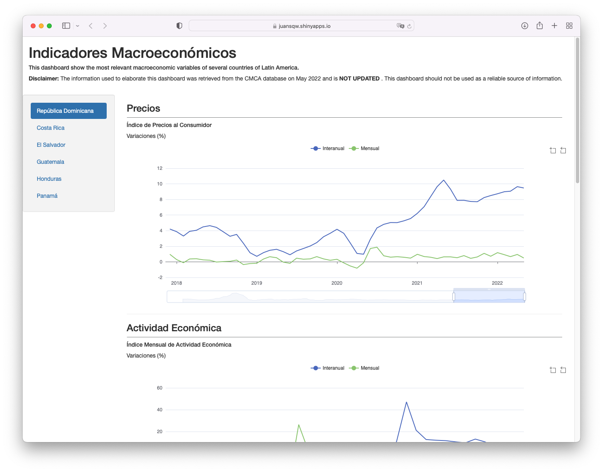

## Latin America - Macroeconomics
Recently I've been working on Shiny Apps developing dashboards and other kinds of visualizations. I was able to develop this dashboard using data from the CMCA database. [This dashboard](https://juansqw.shinyapps.io/la_dash/) summarizes the information of some countries.

I used this project to practice using Shiny modules to create graphs and realized that I need to work on my CSS abilities. Even though I know how to use CSS, it is very challenging for me to define **how** i would like things to look like, so it's almost impossible to come up with some "good-looking" designs.

Something else that I learned with this project was that I could use functions to reduce writing (and the probability of making a typing mistake). For example, in the UI section of the app, I had to write the same code for each country. Instead of this one can write a function containing how one country should look like and then pass it to a list of countries.
